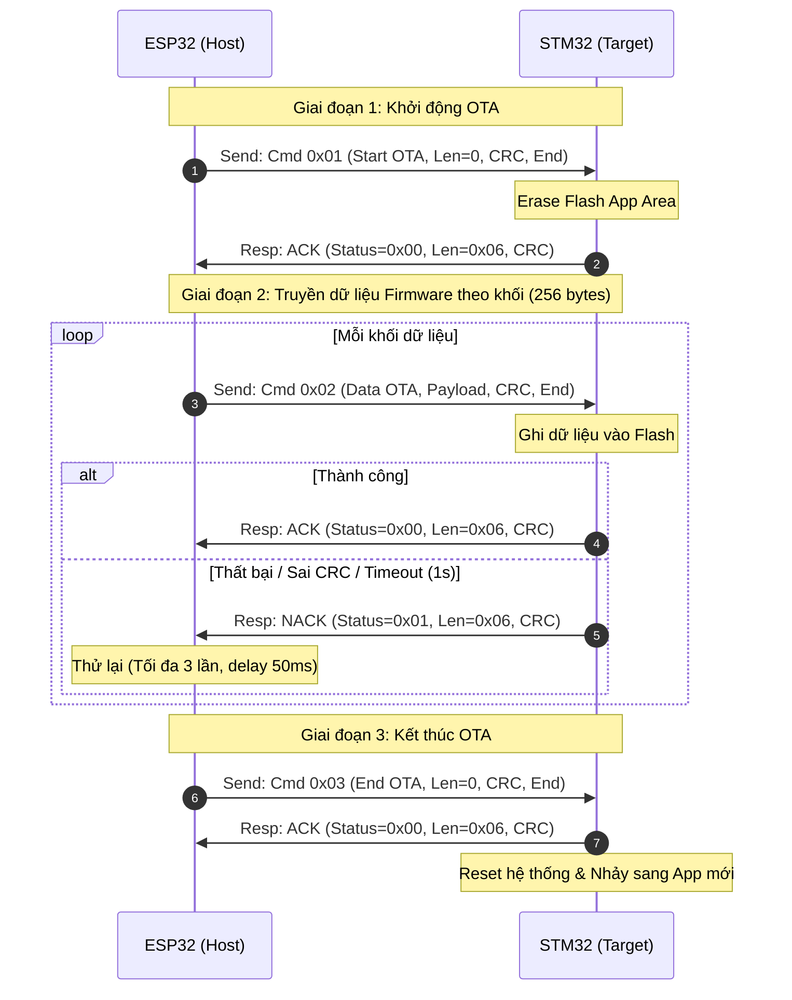

# Quy Chuẩn Mã Hóa và Giao Tiếp UART (OTA) giữa ESP32 & STM32

Tài liệu này tổng hợp toàn bộ quy chuẩn về cấu trúc Frame dữ liệu, cấu trúc gói phản hồi (ACK/NACK), giải thuật kiểm tra lỗi CRC-16, và luồng điều khiển (Flow Control) trong quá trình truyền nạp Firmware từ xa (OTA) giữa **ESP32 (Host)** và **STM32 (Target)**.

---

## 1. Cấu hình phần cứng UART
Giao tiếp UART giữa ESP32 và STM32 hoạt động theo chuẩn cấu hình sau:
* **Baud Rate:** `115200`
* **Data Bits:** `8`
* **Parity:** `None`
* **Stop Bits:** `1`
* **Flow Control:** `None` (Kiểm soát luồng bằng phần mềm thông qua giao thức ACK/NACK)

---

## 2. Cấu trúc Frame Dữ liệu (ESP32 -> STM32)

Mỗi gói tin gửi từ ESP32 sang STM32 tuân thủ cấu trúc sau:

| Thành phần | Kích thước | Giá trị | Mô tả |
| :--- | :---: | :---: | :--- |
| **START_1** | 1 byte | `0xAA` | Byte đồng bộ bắt đầu gói tin |
| **START_2** | 1 byte | `0xBB` | Byte đồng bộ bắt đầu gói tin |
| **COMMAND** | 1 byte | Xem bên dưới | Lệnh điều khiển tiến trình OTA |
| **LENGTH** | 2 bytes | Big Endian | Độ dài của vùng dữ liệu `PAYLOAD` (N bytes) |
| **PAYLOAD** | N bytes | Mảng dữ liệu | Dữ liệu firmware nhị phân thực tế (0 - 256 bytes) |
| **CRC16** | 2 bytes | Big Endian | Mã kiểm tra lỗi Modbus CRC-16 (tính từ `START_1` đến hết `PAYLOAD`) |
| **END** | 1 byte | `0xED` | Byte kết thúc để xác nhận gói tin nguyên vẹn |

### Các Lệnh Điều Khiển (`COMMAND`)
* **`0x01` (START_OTA):** Báo hiệu bắt đầu quá trình OTA. Yêu cầu STM32 xóa vùng nhớ Flash chuẩn bị ghi App mới. `LENGTH` gửi kèm bằng `0x0000` (không có payload).
* **`0x02` (DATA_OTA):** Khối dữ liệu nhị phân của Firmware. `LENGTH` thường là `256` bytes (hoặc nhỏ hơn đối với block cuối cùng của file).
* **`0x03` (END_OTA):** Kết thúc quá trình truyền dữ liệu. Yêu cầu STM32 kiểm tra tổng thể và thực hiện reset hệ thống để kích hoạt App mới. `LENGTH` gửi kèm bằng `0x0000` (không có payload).

### Struct Minh Họa (C/C++)
```cpp
// Tổng kích thước Frame tối đa = 2 (Start) + 1 (Cmd) + 2 (Len) + 256 (Payload) + 2 (CRC) + 1 (End) = 264 bytes
struct OtaPacket {
    uint8_t start_1 = 0xAA;
    uint8_t start_2 = 0xBB;
    uint8_t command;
    uint16_t length; // Big Endian
    uint8_t payload[256];
    uint16_t crc16;  // Big Endian
    uint8_t end_byte = 0xED;
};
```

---

## 3. Cấu trúc Gói Phản Hồi (STM32 -> ESP32)

Sau khi nhận được mỗi gói tin từ ESP32, STM32 sẽ thực hiện giải mã, kiểm tra CRC và gửi lại một gói tin phản hồi có kích thước cố định là **6 bytes**:

| Thành phần | Kích thước | Giá trị | Mô tả |
| :--- | :---: | :---: | :--- |
| **RESP_HEADER_1** | 1 byte | `0xAA` | Byte đồng bộ bắt đầu gói phản hồi |
| **RESP_HEADER_2** | 1 byte | `0xBB` | Byte đồng bộ bắt đầu gói phản hồi |
| **STATUS** | 1 byte | Xem bên dưới | Kết quả kiểm tra gói tin |
| **RESP_LENGTH** | 1 byte | `0x06` | Tổng độ dài của gói phản hồi |
| **CRC_H** | 1 byte | Big Endian | Byte cao của Modbus CRC-16 (tính trên 4 byte đầu tiên) |
| **CRC_L** | 1 byte | Big Endian | Byte thấp của Modbus CRC-16 (tính trên 4 byte đầu tiên) |

> [!IMPORTANT]
> Khác với gói gửi từ ESP32, gói phản hồi từ STM32 **không** chứa byte kết thúc `END` (`0xED`).

### Các Mã Trạng Thái (`STATUS`)
* **`0x00` (OTA_ACK):** Gói tin hợp lệ (đúng định dạng, đúng CRC). STM32 đã xử lý thành công.
* **`0x01` (OTA_NACK):** Lỗi gói tin (sai CRC, kích thước vượt quá quy định). ESP32 cần thực hiện gửi lại.

---

## 4. Quy trình truyền nhận (Flow Control & State Machine)

Tiến trình OTA được thực hiện qua 3 giai đoạn chặt chẽ nhằm tránh mất dữ liệu:



### Các quy định về Timeout và Retry:
1. **Timeout lệnh Start (`0x01`):** Chờ phản hồi tối đa **5000ms** (do thao tác xóa Flash của STM32 mất nhiều thời gian hơn).
2. **Timeout khối dữ liệu (`0x02`):** Chờ phản hồi tối đa **1000ms**.
3. **Cơ chế gửi lại (Retry):**
   * Nếu ESP32 nhận được `OTA_NACK` hoặc hết thời gian timeout mà chưa có phản hồi hợp lệ, nó sẽ gửi lại khối dữ liệu đó.
   * Số lần thử lại tối đa: **3 lần**.
   * Khoảng trễ giữa các lần thử lại: **50ms** (để STM32 có thời gian giải phóng/xóa bộ đệm nhận UART).
   * Nếu thử lại quá 3 lần liên tiếp vẫn thất bại, tiến trình OTA lập tức bị hủy bỏ để đảm bảo an toàn.

---

## 5. Giải thuật kiểm tra lỗi CRC-16 Modbus

Cả hai vi điều khiển đều sử dụng thuật toán **CRC-16 Modbus** với đa thức sinh `0xA001` (dạng đảo của `0x8005`) và giá trị khởi tạo `0xFFFF` để tính checksum.

### Code mẫu tính toán CRC-16 Modbus (C/C++)
Mã nguồn tính CRC dùng chung cho cả ESP32 và STM32:
```c
uint16_t CRC16_Modbus(uint8_t *buf, uint16_t len)
{
    uint16_t crc = 0xFFFF;

    for (uint16_t pos = 0; pos < len; pos++)
    {
        crc ^= (uint16_t)buf[pos];

        for (uint8_t i = 0; i < 8; i++)
        {
            if (crc & 0x0001)
            {
                crc = (crc >> 1) ^ 0xA001;
            }
            else
            {
                crc >>= 1;
            }
        }
    }

    return crc;
}
```

* **Vùng tính CRC gói gửi (ESP32 -> STM32):** Tính trên toàn bộ gói ngoại trừ 3 byte cuối (2 byte CRC + 1 byte END). Hay nói cách khác là tính `5 + payload_len` byte đầu tiên.
* **Vùng tính CRC gói nhận (STM32 -> ESP32):** Tính trên 4 byte đầu tiên (`RESP_HEADER_1` + `RESP_HEADER_2` + `STATUS` + `RESP_LENGTH`).

---

## 6. Cơ chế tự động khôi phục và thông điệp Gỡ lỗi (Debug)

Khi xảy ra lỗi CRC trên đường truyền, ngoài việc phản hồi gói `OTA_NACK (0x01)`, STM32 sẽ tự động gửi kèm một thông điệp văn bản (ASCII String) để ESP32 có thể in ra terminal phục vụ chuẩn đoán lỗi:

* **Định dạng thông điệp gỡ lỗi:** 
  `[DBG:cal=<crc_tính_được>,rev=<crc_nhận_được>,len=<độ_dài_payload>,cnt=<tổng_byte_đã_nhận>,f3=<3_byte_đầu_tiên>]`
* **Giải phóng bộ đệm:** Sau khi gửi thông điệp lỗi, STM32 tự động xóa cờ lỗi phần cứng UART (như ORE - Overrun, NE - Noise, FE - Framing Error) và xả sạch các byte rác còn dư trên thanh ghi dịch để đảm bảo bộ thu UART sẵn sàng nhận lại gói tin chuẩn xác.

---

## 7. Mã Nguồn Tham Chiếu
* **Phía ESP32 (Gửi/Đóng gói):** [main.cpp](file:///mnt/Storage/Workspaces/Projects/OTA-For-STM/ESP32/ReadAndEncode/src/main.cpp)
* **Phía STM32 (Nhận/Giải mã):** [main.c](file:///mnt/Storage/Workspaces/Projects/OTA-For-STM/STM32/GetData/Src/main.c)
